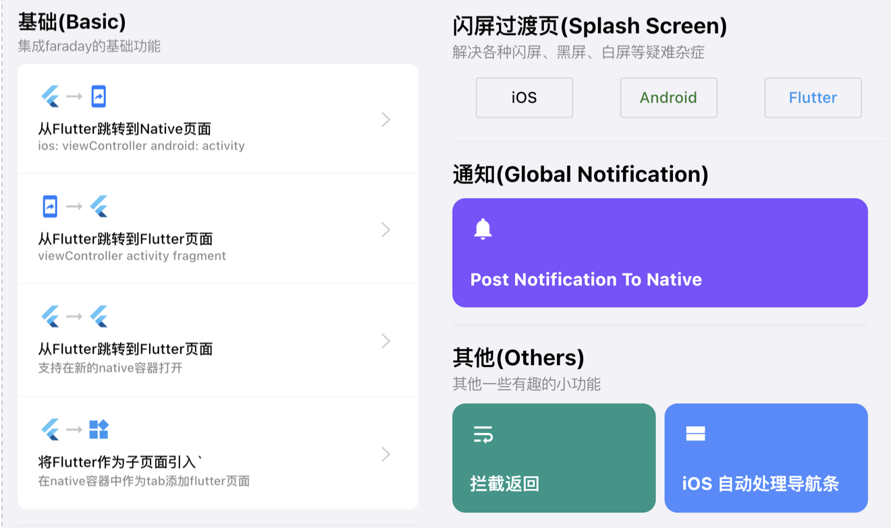

#   Faraday


一个`Flutter`混合栈开发解决方案

## Features

- [x] iOS/Android原生页面堆栈与`Flutter Navigator`无缝桥接
- [x] [页面间回调](docs/callback.md)
- [x] [iOS导航条自动隐藏/显示](docs/ios_navigation_bar.md)
- [x] iOS支持`push`与`present`
- [x] Android支持`Activity`与`Fragment`
- [x] `WillPopScope`拦截滑动返回(ios)或者返回按键键(android)
- [x] [发送/接收全局通知](doc/notification.md)
- [x] 支持自定义页面切换动画
- [x] 完整的文档(7/10)

## Show Cases



## 设计原则

- 对原有平台最小侵入
- 对现有代码最小改动
- API尽量保持和原有平台一致

## 更新策略

_Flutter **stable channel** 发布后 **一周内**适配发布对应的`g_faraday`版本_

## Example App

[Android下载apk](https://github.com/gfaraday/g_faraday/releases/download/0.4.2/example.apk)

[iOS下载app](https://github.com/gfaraday/g_faraday/releases/download/0.4.2/example.app.zip)
> [模拟器安装app](doc/ios-simulator-install.md)

## Requirements

- Flutter 1.24.0-10.2.pre • channel beta
- iOS 10.0+ Xcode 12.0+ Swift 5.1+
- Android minSdkVersion 16 Kotlin 1.4.10+

## 快速开始

如果您已经有其他类似框架使用经验，可以直接查看[Example](example/)浏览最佳实践。

### 添加依赖

``` yaml
dependencies:
  # 请确认与本地Flutter兼容的版本
  g_faraday: ^0.4.2
```

### Flutter 端集成

flutter侧的集成工作，主要是注册需要从原生打开的页面。

``` dart

// 0x00 定义 route
final route = faraday.wrapper((settings) {
    switch (settings.name) {
    case 'first_page':
        return CupertinoPageRoute(builder: (context) => Text('First Page'));
    case 'second_page':
        return CupertinoPageRoute(builder: (context) => Text('Second Page'));
    }
    return CupertinoPageRoute(builder: (context) => Text(settings.name));
});

// 0x01 将 route 赋给你的app widget
CupertinoApp(onGenerateRoute: (_) => route);

// 0x02 flutter 侧集成完毕，接下来你可以选择 集成iOS/Android
```

### iOS 集成

为了实现从`Flutter`端打开原生页面的应用场景，所以我们需要实现一个打开原生页面的protocol

``` swift

// 0x00 实现 `FaradayNavigationDelegate`
extension AppDelegate: FaradayNavigationDelegate {

    func push(_ name: String, arguments: Any?, options: [String : Any]?) -> UIViewController? {

        let isFlutter = options?["flutter"] as? Bool ?? false
        let isPresent = options?["present"] as? Bool ?? false

        let vc = isFlutter ? FaradayFlutterViewController(name, arguments: arguments) : FirstViewController(name， arguments: arguments)

        let topMost = UIViewController.fa.topMost
        if (isPresent) {
            topMost?.present(vc, animated: true, completion: nil)
        } else {
            topMost?.navigationController?.pushViewController(vc, animated: true)
        }

        return vc
    }
}

// 0x01 在 `application: didFinishLaunchingWithOptions`中启动flutter engine
Faraday.default.startFlutterEngine(navigatorDelegate: self)


// 0x02 打开一个flutter 页面
let vc = FaradayFlutterViewController("first_page", arguments: nil)
navigationController?.pushViewController(vc, animated: true)

// 0x03 集成完毕
```

### Android 集成

为了实现从`Flutter`端打开原生页面的应用场景，所以我们需要实现一组打开原生页面的接口

``` kotlin

// 0x00 实现 navigator
class SimpleFlutterNavigator : FaradayNavigator {

    companion object {
        const val KEY_ARGS = "_args"
    }

    override fun create(name: String, arguments: Serializable?, options: HashMap<String, *>?): Intent? {
        val context = Faraday.getCurrentActivity() ?: return null

        val isFlutterRoute = options?.get("flutter") == true

        if (isFlutterRoute) {
            // singleTask 模式
            val builder = FaradayActivity.builder(name, arguments)

            // 你看到的绿色的闪屏就是这个
            builder.backgroundColor = Color.WHITE
            builder.activityClass = SingleTaskFlutterActivity::class.java

            return builder.build(context);
        }

        when (name) {
            "flutter2native" -> {
                return Intent(context, FlutterToNativeActivity::class.java)
            }
            "native2flutter" -> {
                return Intent(context, Native2FlutterActivity::class.java)
            }
            "tabContainer" -> {
                return Intent(context, TabContainerActivity::class.java)
            }
            else -> {
                val intent = Intent(Intent.ACTION_VIEW)
                intent.data = Uri.parse(name)
                intent.putExtra(KEY_ARGS, arguments)
                return intent
            }
        }

    }

    override fun pop(result: Serializable?) {
        val activity = Faraday.getCurrentActivity() ?: return
        if (result != null) {
            activity.setResult(Activity.RESULT_OK, Intent().apply { putExtra(KEY_ARGS, result) })
        }
        activity.finish()
    }

    override fun enableSwipeBack(enable: Boolean) {

    }

}

// 0x01 在 Application 的onCreate方法中启动FlutterEngine
if (!Faraday.initEngine(this, SimpleFlutterNavigator())) {
    GeneratedPluginRegistrant.registerWith(Faraday.engine)
}

// 0x02 打开一个Flutter页面
val intent = FaradayActivity.build(context, routeName, params)
context.startActivity(intent)

```

## faraday 全家桶 (推荐)

在进行Flutter混合开发时会遇到很多相似的问题，我们提供了相应的解决方案大家玩的开心。

- [路由](doc/route.md)
- [桥接原生方法](doc/bridge.md)
- [网络请求](doc/net.md)
- [JSON](doc/json.md)
- [命令行工具 | 代码生成 | 打包发布 | CI/CD](https://github.com/gfaraday/cli)
- [vscode 插件 | 自动补全 | 打包发布](https://github.com/gfaraday/faraday_extension)

## FAQ

## Communication

[点击加入钉钉群](https://qr.dingtalk.com/action/joingroup?code=v1,k1,5FUqLooXjcj0166ehqb9qapZT5t7gbUpjQqrXc2H4a4=&_dt_no_comment=1&origin=11)


## Contributing

If you wish to contribute a change to any of the existing plugins in this repo, please review our [contribution](CONTRIBUTING.md) guide and open a pull request.

## License

g_faraday is released under the MIT license. [See LICENSE](LICENSE) for details.
